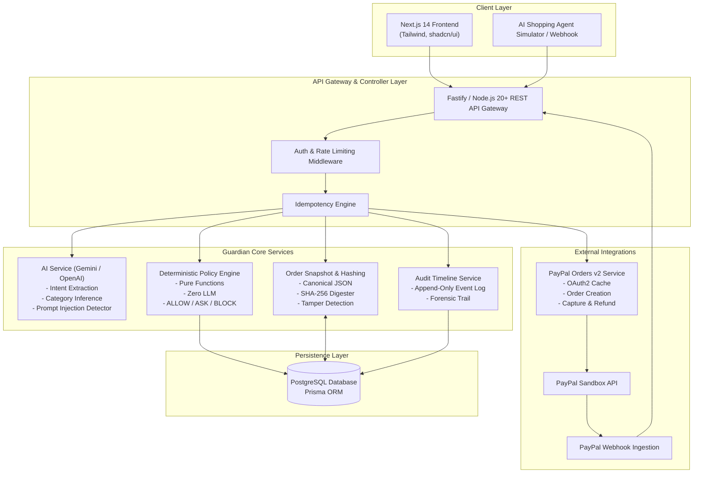
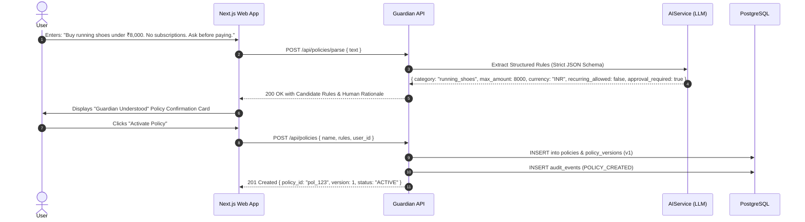
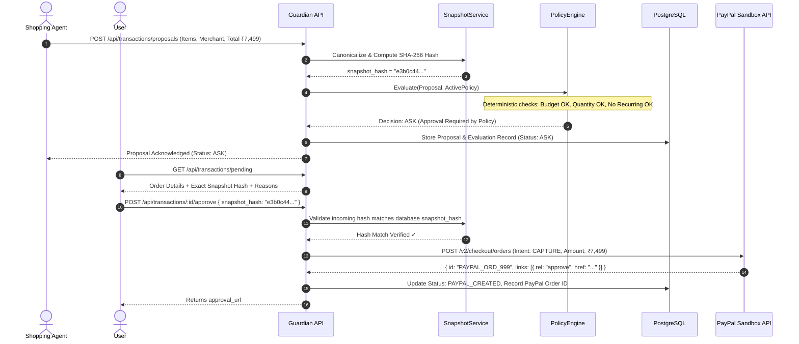
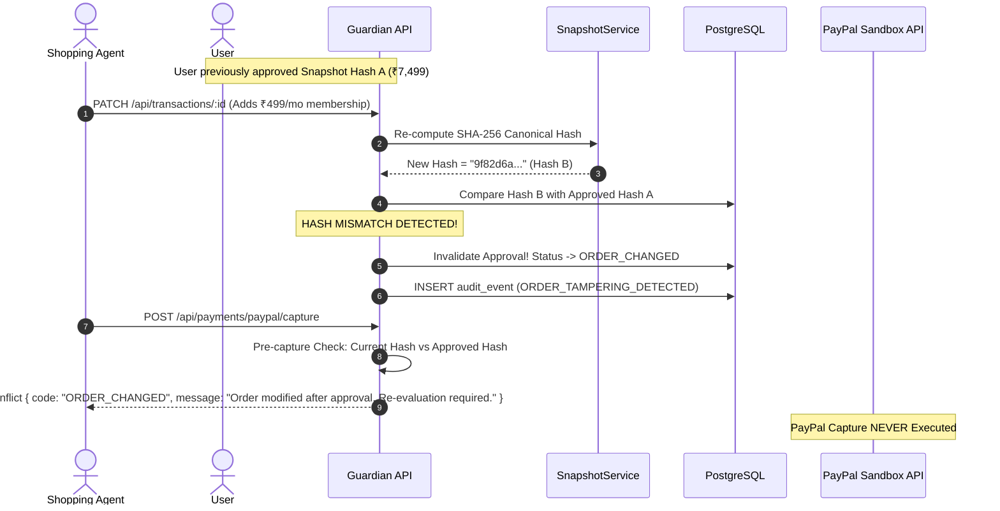

# 01. System Architecture & System Design

## 1. Architectural Philosophy & Core Axioms

PayPal Guardian is engineered upon four non-negotiable architectural axioms:

1. **Probabilistic vs. Deterministic Isolation:**
   Large Language Models (LLMs) are probabilistic pattern recognizers. They possess inherent vulnerability to hallucinations, jailbreaks, and prompt injections. Therefore, **LLMs are strictly confined to semantic parsing, category classification, and risk heuristics**. Under zero circumstances does an LLM emit final financial authorization (`ALLOW`, `ASK`, `BLOCK`) or interact directly with payment gateway credentials.
   
2. **Deterministic Sovereignty:**
   All financial rules (budgets, item limits, merchant whitelists, subscription blocks) are evaluated by a pure, deterministic, zero-dependency policy engine. Given Policy $P$ and Order Proposal $O$, the evaluation function $f(P, O)$ is strictly reproducible, immutable, and provable.

3. **Cryptographic Snapshot Binding:**
   An approval given by a user is never attached to an abstract intention or mutable database record. It is cryptographically bound via SHA-256 hash to an immutable, canonical JSON representation of the entire cart (items, prices, tax, shipping, merchant, fees, recurring flag). Any modification to the cart generates a mismatched hash and triggers immediate authorization revocation.

4. **Zero-Trust External Payment Boundary:**
   PayPal client secrets and webhook signing keys never touch frontend bundles or autonomous AI agents. All PayPal API invocations (Order Creation, Capture, Webhook Verification) occur server-side with strict idempotency keys (`PayPal-Request-Id`).

---

## 2. Component Architecture



### 2.1 Web Client (Next.js 14 App Router)
- **Role:** Interactive dashboard, natural language policy creation wizard, real-time approval hub, tamper notification center, and transaction audit timeline visualizer.
- **Key Modules:**
  - `PolicyCreator`: Guided conversational input with live structured rule preview before activation.
  - `ApprovalModal`: Displays exact order breakdown, highlighting rule adherence, warnings, and PayPal redirect CTA.
  - `BlockedAlert`: Deep-dive rationale view explaining exact rule violations (e.g., budget exceeded by ₹1,200).
  - `AuditTimeline`: Visual breadcrumb tracking policy creation down to final webhook settlement.

### 2.2 API Gateway & Core Backend (Fastify / TypeScript)
- Fastify provides ultra-low latency (<10ms overhead) and strict JSON Schema compilation using Ajv.
- Implements request validation, rate limiting, and centralized error normalization.

### 2.3 AI Service (`AIService`)
- Encapsulates LLM interactions behind an abstract interface (`IAIService`).
- Enforces strict JSON Schema outputs via OpenAI Structured Outputs or Google Gemini Function Calling / JSON mode.
- Evaluates untrusted product descriptions for prompt injection signals (`SUSPICIOUS_INSTRUCTION`).

### 2.4 Deterministic Policy Engine (`PolicyEngine`)
- Implemented as pure TypeScript functions with zero external dependencies and zero I/O side effects.
- Executes sequential evaluation:
  1. Currency Match Check
  2. Total Budget Threshold Check
  3. Recurring / Subscription Charge Check
  4. Item Category Blacklist/Whitelist Check
  5. Maximum Quantity Check
  6. Merchant Whitelist/Blacklist Check
  7. Risk Assessment Integration
  8. Approval Requirement Determination

### 2.5 Snapshot & Tamper Detection Service (`SnapshotService`)
- Formats proposed orders into canonical key-sorted JSON.
- Generates a SHA-256 hash representing the immutable contract state.
- During user approval and prior to PayPal capture, validates that `current_snapshot_hash === approved_snapshot_hash`. If mismatch occurs, status shifts to `ORDER_CHANGED` and transaction aborts.

### 2.6 PayPal Gateway (`PayPalGateway`)
- Manages cached OAuth2 bearer tokens with automatic refresh prior to expiration.
- Interacts with PayPal v2 Checkout Orders API:
  - `POST /v2/checkout/orders` (Intent: `CAPTURE`)
  - `POST /v2/checkout/orders/{id}/capture`
- Ingests and cryptographically verifies webhooks (`CHECKOUT.ORDER.APPROVED`, `PAYMENT.CAPTURE.COMPLETED`).

---

## 3. Detailed Sequence Diagrams

### 3.1 Policy Creation & Confirmation Flow



### 3.2 Order Proposal, Deterministic Evaluation & Approval Flow



### 3.3 Order Tampering & Silent Inflation Defense Flow



---

## 4. State Machine Specification

The transaction proposal progresses through a strict, finite state machine:

```
               [ CREATED ]
                    │
                    ▼
              [ EVALUATING ]
              /     │      \
             /      │       \
            ▼       ▼        ▼
       [ BLOCKED ] [ ASK ] [ ALLOW ]
                    │        │
                    ▼        │
             [ USER_APPROVED ]
                    │        │
                    └───┬────┘
                        │
                        ▼
                [ PAYPAL_CREATED ]
                        │
                        ▼
                [ PAYPAL_APPROVED ]
                        │
                        ▼
                  [ CAPTURING ]
                   /         \
                  ▼           ▼
            [ COMPLETED ]   [ FAILED ]

Terminal States:
- BLOCKED: Violated deterministic rules.
- USER_REJECTED: User declined proposed order.
- ORDER_CHANGED: Snapshot hash invalidated due to mutation.
- EXPIRED: User or PayPal approval session timed out.
- COMPLETED: Payment captured and verified via webhook.
- FAILED: PayPal processing or network failure.
```

---

## 5. Deployment Topology

```
+-------------------------------------------------------------+
|                      Edge / CDN (Vercel)                    |
| Next.js 14 Web Dashboard (SSR & Static Assets)             |
+------------------------------+------------------------------+
                               | HTTPS / TLS 1.3
                               v
+-------------------------------------------------------------+
|                 Container Runtime (Render / AWS ECS)         |
| Fastify Node.js 20+ Guardian Gateway                        |
| - Deterministic Policy Engine                               |
| - Snapshot Canonicalizer & SHA-256 Engine                   |
| - PayPal v2 Orders Client                                   |
| - Webhook Ingestion Engine                                  |
+----------------+-----------------------------+--------------+
                 |                             |
                 v                             v
+-------------------------------+ +---------------------------+
| PostgreSQL (Neon Serverless)  | | External APIs             |
| - Relational DB & Audit Logs  | | - PayPal Sandbox API      |
| - Read Replicas for Analytics | | - LLM Provider (Gemini /  |
+-------------------------------+ |   OpenAI Structured API)  |
                                  +---------------------------+
```
