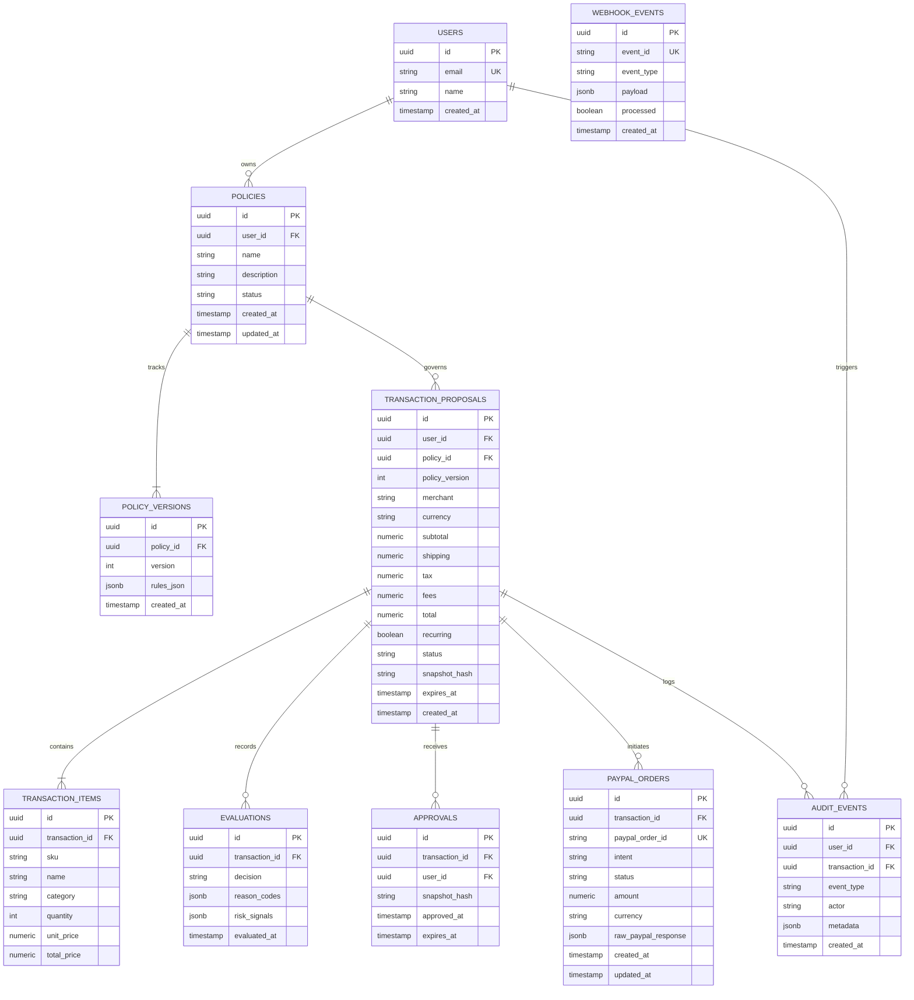

# 02. Data Models & Database Schema

## 1. Entity Relationship Diagram (ERD)



---

## 2. PostgreSQL DDL Specification

```sql
-- Enable UUID generation extension
CREATE EXTENSION IF NOT EXISTS "uuid-ossp";

-- 1. Users Table
CREATE TABLE users (
    id UUID PRIMARY KEY DEFAULT uuid_generate_v4(),
    email VARCHAR(255) NOT NULL UNIQUE,
    name VARCHAR(255) NOT NULL,
    created_at TIMESTAMPTZ NOT NULL DEFAULT NOW()
);

-- 2. Policies Table
CREATE TYPE policy_status AS ENUM ('ACTIVE', 'PAUSED', 'ARCHIVED');

CREATE TABLE policies (
    id UUID PRIMARY KEY DEFAULT uuid_generate_v4(),
    user_id UUID NOT NULL REFERENCES users(id) ON DELETE CASCADE,
    name VARCHAR(255) NOT NULL,
    description TEXT,
    status policy_status NOT NULL DEFAULT 'ACTIVE',
    created_at TIMESTAMPTZ NOT NULL DEFAULT NOW(),
    updated_at TIMESTAMPTZ NOT NULL DEFAULT NOW()
);

CREATE INDEX idx_policies_user_status ON policies(user_id, status);

-- 3. Policy Versions Table (Immutability guarantee)
CREATE TABLE policy_versions (
    id UUID PRIMARY KEY DEFAULT uuid_generate_v4(),
    policy_id UUID NOT NULL REFERENCES policies(id) ON DELETE CASCADE,
    version INT NOT NULL,
    rules_json JSONB NOT NULL,
    created_at TIMESTAMPTZ NOT NULL DEFAULT NOW(),
    CONSTRAINT uq_policy_version UNIQUE(policy_id, version)
);

CREATE INDEX idx_policy_versions_lookup ON policy_versions(policy_id, version DESC);

-- 4. Transaction Proposals Table
CREATE TYPE transaction_status AS ENUM (
    'CREATED',
    'EVALUATING',
    'ALLOW',
    'ASK',
    'USER_APPROVED',
    'USER_REJECTED',
    'PAYPAL_CREATED',
    'PAYPAL_APPROVED',
    'CAPTURED',
    'COMPLETED',
    'BLOCKED',
    'ORDER_CHANGED',
    'EXPIRED',
    'CANCELLED',
    'FAILED'
);

CREATE TABLE transaction_proposals (
    id UUID PRIMARY KEY DEFAULT uuid_generate_v4(),
    user_id UUID NOT NULL REFERENCES users(id) ON DELETE CASCADE,
    policy_id UUID NOT NULL REFERENCES policies(id) ON DELETE RESTRICT,
    policy_version INT NOT NULL,
    merchant VARCHAR(255) NOT NULL,
    currency VARCHAR(10) NOT NULL DEFAULT 'INR',
    subtotal NUMERIC(12, 2) NOT NULL,
    shipping NUMERIC(12, 2) NOT NULL DEFAULT 0.00,
    tax NUMERIC(12, 2) NOT NULL DEFAULT 0.00,
    fees NUMERIC(12, 2) NOT NULL DEFAULT 0.00,
    total NUMERIC(12, 2) NOT NULL,
    recurring BOOLEAN NOT NULL DEFAULT FALSE,
    status transaction_status NOT NULL DEFAULT 'CREATED',
    snapshot_hash CHAR(64) NOT NULL, -- SHA-256 Hex Digest
    expires_at TIMESTAMPTZ NOT NULL,
    created_at TIMESTAMPTZ NOT NULL DEFAULT NOW(),
    updated_at TIMESTAMPTZ NOT NULL DEFAULT NOW()
);

CREATE INDEX idx_tx_user_status ON transaction_proposals(user_id, status);
CREATE INDEX idx_tx_snapshot_hash ON transaction_proposals(snapshot_hash);

-- 5. Transaction Items Table
CREATE TABLE transaction_items (
    id UUID PRIMARY KEY DEFAULT uuid_generate_v4(),
    transaction_id UUID NOT NULL REFERENCES transaction_proposals(id) ON DELETE CASCADE,
    sku VARCHAR(100),
    name VARCHAR(255) NOT NULL,
    category VARCHAR(100) NOT NULL,
    quantity INT NOT NULL CHECK (quantity > 0),
    unit_price NUMERIC(12, 2) NOT NULL CHECK (unit_price >= 0),
    total_price NUMERIC(12, 2) NOT NULL CHECK (total_price >= 0),
    created_at TIMESTAMPTZ NOT NULL DEFAULT NOW()
);

CREATE INDEX idx_tx_items_transaction_id ON transaction_items(transaction_id);

-- 6. Evaluations Table
CREATE TYPE evaluation_decision AS ENUM ('ALLOW', 'ASK', 'BLOCK');

CREATE TABLE evaluations (
    id UUID PRIMARY KEY DEFAULT uuid_generate_v4(),
    transaction_id UUID NOT NULL REFERENCES transaction_proposals(id) ON DELETE CASCADE,
    decision evaluation_decision NOT NULL,
    reason_codes JSONB NOT NULL DEFAULT '[]'::jsonb,
    risk_signals JSONB NOT NULL DEFAULT '{}'::jsonb,
    evaluated_at TIMESTAMPTZ NOT NULL DEFAULT NOW()
);

CREATE INDEX idx_evaluations_tx ON evaluations(transaction_id);

-- 7. Approvals Table
CREATE TABLE approvals (
    id UUID PRIMARY KEY DEFAULT uuid_generate_v4(),
    transaction_id UUID NOT NULL REFERENCES transaction_proposals(id) ON DELETE CASCADE,
    user_id UUID NOT NULL REFERENCES users(id) ON DELETE CASCADE,
    snapshot_hash CHAR(64) NOT NULL,
    approved_at TIMESTAMPTZ NOT NULL DEFAULT NOW(),
    expires_at TIMESTAMPTZ NOT NULL,
    CONSTRAINT uq_approval_tx_hash UNIQUE(transaction_id, snapshot_hash)
);

CREATE INDEX idx_approvals_tx ON approvals(transaction_id);

-- 8. PayPal Orders Table
CREATE TABLE paypal_orders (
    id UUID PRIMARY KEY DEFAULT uuid_generate_v4(),
    transaction_id UUID NOT NULL REFERENCES transaction_proposals(id) ON DELETE CASCADE,
    paypal_order_id VARCHAR(100) NOT NULL UNIQUE,
    intent VARCHAR(20) NOT NULL DEFAULT 'CAPTURE',
    status VARCHAR(50) NOT NULL,
    amount NUMERIC(12, 2) NOT NULL,
    currency VARCHAR(10) NOT NULL,
    raw_paypal_response JSONB NOT NULL,
    created_at TIMESTAMPTZ NOT NULL DEFAULT NOW(),
    updated_at TIMESTAMPTZ NOT NULL DEFAULT NOW()
);

CREATE INDEX idx_paypal_order_lookup ON paypal_orders(paypal_order_id);

-- 9. Webhook Events Table (Idempotency control)
CREATE TABLE webhook_events (
    id UUID PRIMARY KEY DEFAULT uuid_generate_v4(),
    event_id VARCHAR(255) NOT NULL UNIQUE,
    event_type VARCHAR(100) NOT NULL,
    payload JSONB NOT NULL,
    processed BOOLEAN NOT NULL DEFAULT FALSE,
    created_at TIMESTAMPTZ NOT NULL DEFAULT NOW()
);

CREATE INDEX idx_webhook_event_id ON webhook_events(event_id);

-- 10. Audit Events Table (Append-Only Event Store)
CREATE TABLE audit_events (
    id UUID PRIMARY KEY DEFAULT uuid_generate_v4(),
    user_id UUID REFERENCES users(id) ON DELETE SET NULL,
    transaction_id UUID REFERENCES transaction_proposals(id) ON DELETE SET NULL,
    event_type VARCHAR(100) NOT NULL,
    actor VARCHAR(100) NOT NULL, -- 'USER', 'AI_AGENT', 'POLICY_ENGINE', 'PAYPAL_WEBHOOK'
    metadata JSONB NOT NULL DEFAULT '{}'::jsonb,
    created_at TIMESTAMPTZ NOT NULL DEFAULT NOW()
);

CREATE INDEX idx_audit_tx ON audit_events(transaction_id, created_at ASC);
CREATE INDEX idx_audit_user ON audit_events(user_id, created_at DESC);
```

---

## 3. Prisma Schema (`prisma/schema.prisma`)

```prisma
datasource db {
  provider = "postgresql"
  url      = env("DATABASE_URL")
}

generator client {
  provider = "prisma-client-js"
}

enum PolicyStatus {
  ACTIVE
  PAUSED
  ARCHIVED
}

enum TransactionStatus {
  CREATED
  EVALUATING
  ALLOW
  ASK
  USER_APPROVED
  USER_REJECTED
  PAYPAL_CREATED
  PAYPAL_APPROVED
  CAPTURED
  COMPLETED
  BLOCKED
  ORDER_CHANGED
  EXPIRED
  CANCELLED
  FAILED
}

enum EvaluationDecision {
  ALLOW
  ASK
  BLOCK
}

model User {
  id            String                @id @default(uuid()) @db.Uuid
  email         String                @unique @db.VarChar(255)
  name          String                @db.VarChar(255)
  createdAt     DateTime              @default(now()) @map("created_at")
  policies      Policy[]
  transactions  TransactionProposal[]
  approvals     Approval[]
  auditEvents   AuditEvent[]

  @@map("users")
}

model Policy {
  id            String                @id @default(uuid()) @db.Uuid
  userId        String                @map("user_id") @db.Uuid
  name          String                @db.VarChar(255)
  description   String?
  status        PolicyStatus          @default(ACTIVE)
  createdAt     DateTime              @default(now()) @map("created_at")
  updatedAt     DateTime              @updatedAt @map("updated_at")
  user          User                  @relation(fields: [userId], references: [id], onDelete: Cascade)
  versions      PolicyVersion[]
  transactions  TransactionProposal[]

  @@index([userId, status])
  @@map("policies")
}

model PolicyVersion {
  id         String   @id @default(uuid()) @db.Uuid
  policyId   String   @map("policy_id") @db.Uuid
  version    Int
  rulesJson  Json     @map("rules_json")
  createdAt  DateTime @default(now()) @map("created_at")
  policy     Policy   @relation(fields: [policyId], references: [id], onDelete: Cascade)

  @@unique([policyId, version])
  @@map("policy_versions")
}

model TransactionProposal {
  id            String             @id @default(uuid()) @db.Uuid
  userId        String             @map("user_id") @db.Uuid
  policyId      String             @map("policy_id") @db.Uuid
  policyVersion Int                @map("policy_version")
  merchant      String             @db.VarChar(255)
  currency      String             @default("INR") @db.VarChar(10)
  subtotal      Decimal            @db.Decimal(12, 2)
  shipping      Decimal            @default(0.00) @db.Decimal(12, 2)
  tax           Decimal            @default(0.00) @db.Decimal(12, 2)
  fees          Decimal            @default(0.00) @db.Decimal(12, 2)
  total         Decimal            @db.Decimal(12, 2)
  recurring     Boolean            @default(false)
  status        TransactionStatus  @default(CREATED)
  snapshotHash  String             @map("snapshot_hash") @db.Char(64)
  expiresAt     DateTime           @map("expires_at")
  createdAt     DateTime           @default(now()) @map("created_at")
  updatedAt     DateTime           @updatedAt @map("updated_at")
  user          User               @relation(fields: [userId], references: [id], onDelete: Cascade)
  policy        Policy             @relation(fields: [policyId], references: [id], onDelete: Restrict)
  items         TransactionItem[]
  evaluations   Evaluation[]
  approvals     Approval[]
  paypalOrders  PayPalOrder[]
  auditEvents   AuditEvent[]

  @@index([userId, status])
  @@index([snapshotHash])
  @@map("transaction_proposals")
}

model TransactionItem {
  id            String              @id @default(uuid()) @db.Uuid
  transactionId String              @map("transaction_id") @db.Uuid
  sku           String?             @db.VarChar(100)
  name          String              @db.VarChar(255)
  category      String              @db.VarChar(100)
  quantity      Int
  unitPrice     Decimal             @map("unit_price") @db.Decimal(12, 2)
  totalPrice    Decimal             @map("total_price") @db.Decimal(12, 2)
  createdAt     DateTime            @default(now()) @map("created_at")
  transaction   TransactionProposal @relation(fields: [transactionId], references: [id], onDelete: Cascade)

  @@index([transactionId])
  @@map("transaction_items")
}

model Evaluation {
  id            String              @id @default(uuid()) @db.Uuid
  transactionId String              @map("transaction_id") @db.Uuid
  decision      EvaluationDecision
  reasonCodes   Json                @default("[]") @map("reason_codes")
  riskSignals   Json                @default("{}") @map("risk_signals")
  evaluatedAt   DateTime            @default(now()) @map("evaluated_at")
  transaction   TransactionProposal @relation(fields: [transactionId], references: [id], onDelete: Cascade)

  @@index([transactionId])
  @@map("evaluations")
}

model Approval {
  id            String              @id @default(uuid()) @db.Uuid
  transactionId String              @map("transaction_id") @db.Uuid
  userId        String              @map("user_id") @db.Uuid
  snapshotHash  String              @map("snapshot_hash") @db.Char(64)
  approvedAt    DateTime            @default(now()) @map("approved_at")
  expiresAt     DateTime            @map("expires_at")
  transaction   TransactionProposal @relation(fields: [transactionId], references: [id], onDelete: Cascade)
  user          User                @relation(fields: [userId], references: [id], onDelete: Cascade)

  @@unique([transactionId, snapshotHash])
  @@index([transactionId])
  @@map("approvals")
}

model PayPalOrder {
  id                String              @id @default(uuid()) @db.Uuid
  transactionId     String              @map("transaction_id") @db.Uuid
  paypalOrderId     String              @unique @map("paypal_order_id") @db.VarChar(100)
  intent            String              @default("CAPTURE") @db.VarChar(20)
  status            String              @db.VarChar(50)
  amount            Decimal             @db.Decimal(12, 2)
  currency          String              @db.VarChar(10)
  rawPayPalResponse Json                @map("raw_paypal_response")
  createdAt         DateTime            @default(now()) @map("created_at")
  updatedAt         DateTime            @updatedAt @map("updated_at")
  transaction       TransactionProposal @relation(fields: [transactionId], references: [id], onDelete: Cascade)

  @@index([paypalOrderId])
  @@map("paypal_orders")
}

model WebhookEvent {
  id         String   @id @default(uuid()) @db.Uuid
  eventId    String   @unique @map("event_id") @db.VarChar(255)
  eventType  String   @map("event_type") @db.VarChar(100)
  payload    Json
  processed  Boolean  @default(false)
  createdAt  DateTime @default(now()) @map("created_at")

  @@index([eventId])
  @@map("webhook_events")
}

model AuditEvent {
  id            String               @id @default(uuid()) @db.Uuid
  userId        String?              @map("user_id") @db.Uuid
  transactionId String?              @map("transaction_id") @db.Uuid
  eventType     String               @map("event_type") @db.VarChar(100)
  actor         String               @db.VarChar(100)
  metadata      Json                 @default("{}")
  createdAt     DateTime             @default(now()) @map("created_at")
  user          User?                @relation(fields: [userId], references: [id], onDelete: SetNull)
  transaction   TransactionProposal? @relation(fields: [transactionId], references: [id], onDelete: SetNull)

  @@index([transactionId, createdAt])
  @@index([userId, createdAt])
  @@map("audit_events")
}
```

---

## 4. Policy JSON Schema (`rules_json`)

Every version of a policy stores a validated JSON object conforming to this schema:

```json
{
  "$schema": "http://json-schema.org/draft-07/schema#",
  "title": "GuardianPolicyRules",
  "type": "object",
  "properties": {
    "max_amount": {
      "type": "number",
      "minimum": 0,
      "description": "Maximum allowed total amount for any single transaction proposal."
    },
    "min_amount": {
      "type": "number",
      "minimum": 0,
      "description": "Optional minimum order amount."
    },
    "currency": {
      "type": "string",
      "enum": ["INR", "USD", "EUR", "GBP"],
      "default": "INR"
    },
    "max_quantity": {
      "type": "integer",
      "minimum": 1,
      "description": "Maximum permitted cumulative item quantity in cart."
    },
    "allowed_categories": {
      "type": "array",
      "items": { "type": "string" },
      "description": "Categories permitted. If empty, all non-blocked categories are permitted."
    },
    "blocked_categories": {
      "type": "array",
      "items": { "type": "string" },
      "description": "Categories strictly prohibited."
    },
    "allowed_merchants": {
      "type": "array",
      "items": { "type": "string" },
      "description": "Whitelisted merchants. If populated, only these merchants are allowed."
    },
    "blocked_merchants": {
      "type": "array",
      "items": { "type": "string" },
      "description": "Blacklisted merchants."
    },
    "recurring_allowed": {
      "type": "boolean",
      "default": false,
      "description": "Whether subscriptions or recurring billing are permissible."
    },
    "approval_required": {
      "type": "boolean",
      "default": true,
      "description": "Whether human authorization is mandated even if all numeric rules pass."
    },
    "recheck_on_change": {
      "type": "boolean",
      "default": true,
      "description": "Invalidates approval if cart snapshot changes before capture."
    }
  },
  "required": ["max_amount", "currency", "recurring_allowed", "approval_required"],
  "additionalProperties": false
}
```
