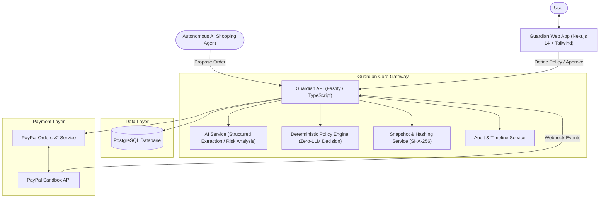
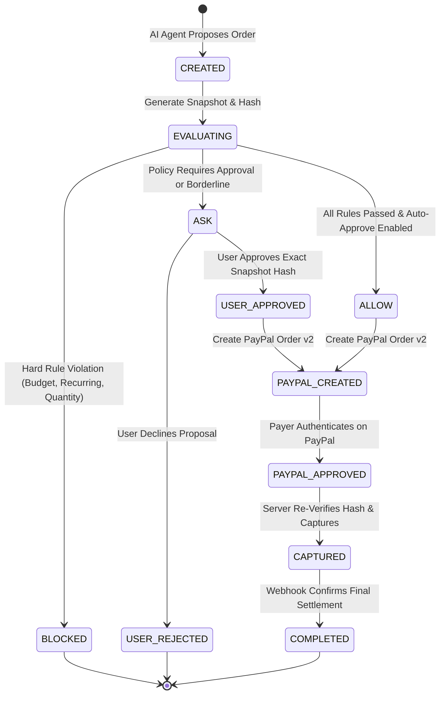

# PayPal Guardian — Engineering Documentation

> **Tagline:** The firewall between AI and your money.  
> **Status:** Production Architecture & Implementation Blueprint  
> **Target:** AI/PayPal Agentic Commerce Hackathon & Enterprise Prototype  
> **Version:** 1.0.0  

---

## 1. Executive Overview

**PayPal Guardian** is an independent, deterministic policy enforcement and authorization gateway positioned between autonomous AI shopping agents and payment processors (specifically PayPal). 

As autonomous AI agents evolve from read-only recommenders to transaction-executing agents, traditional payment infrastructure faces a major vulnerability: **an AI agent cannot be granted unrestricted financial authority**. Even with benign intent, LLMs suffer from hallucinations, misinterpretations, susceptibility to prompt injection attacks embedded in merchant product descriptions, and inability to enforce hard financial boundaries deterministically.

Guardian solves this by establishing a zero-trust authorization boundary:
1. **Natural Language Policy Authoring:** Users express spending boundaries in natural language, which are translated into structured, immutable JSON policy schemas with explicit human verification.
2. **Deterministic Evaluation Engine:** The LLM is strictly prohibited from making payment authorization decisions. Instead, an isolated, zero-hallucination deterministic engine evaluates proposed orders against active policy rules.
3. **Cryptographic Snapshot Hashing:** Orders are locked with canonical SHA-256 state hashes. Any silent price fluctuation, item mutation, or injected subscription fee invalidates prior user approvals immediately.
4. **Controlled PayPal Checkout:** Only orders receiving `ALLOW` or explicit user-signed `ASK` approvals can instantiate PayPal Orders v2 flows and execute server-side captures.

---

## 2. Documentation Index

The documentation suite in this directory provides complete, production-grade technical specifications designed for full-stack senior developers, security auditors, and system architects:

| Document | Title | Description |
| :--- | :--- | :--- |
| **[01_ARCHITECTURE_SYSTEM_DESIGN.md](./01_ARCHITECTURE_SYSTEM_DESIGN.md)** | System Architecture & Design | C4 architecture diagrams, sequence diagrams, micro-component contracts, state machines, and end-to-end data flow. |
| **[02_DATA_MODELS_AND_DATABASE_SCHEMA.md](./02_DATA_MODELS_AND_DATABASE_SCHEMA.md)** | Database Schema & Data Models | Complete PostgreSQL DDL, Prisma schema, foreign key relations, snapshot indexes, and audit event logging schemas. |
| **[03_API_SPECIFICATION.md](./03_API_SPECIFICATION.md)** | REST API Specification | Comprehensive endpoint contracts, HTTP status codes, request/response JSON payloads, validation errors, and standardized reason codes. |
| **[04_POLICY_ENGINE_AND_SECURITY_SPEC.md](./04_POLICY_ENGINE_AND_SECURITY_SPEC.md)** | Policy Engine & Tamper Proofing | Deterministic evaluation algorithm, canonical SHA-256 snapshot hashing, prompt injection defense, and risk scoring. |
| **[05_PAYPAL_INTEGRATION_AND_CHECKOUT_FLOW.md](./05_PAYPAL_INTEGRATION_AND_CHECKOUT_FLOW.md)** | PayPal Integration & Webhooks | PayPal Orders v2 API integration, OAuth2 token management, idempotency handling, client approval redirection, capture flow, and webhook verification. |
| **[06_IMPLEMENTATION_ROADMAP_AND_TASK_BREAKDOWN.md](./06_IMPLEMENTATION_ROADMAP_AND_TASK_BREAKDOWN.md)** | Implementation Roadmap & Test Plan | 7-day development plan, recommended repository scaffolding, unit/integration test matrices, and 7-scene hackathon demo script. |
| **[07_THREAT_MODEL_AND_SECURITY_AUDIT.md](./07_THREAT_MODEL_AND_SECURITY_AUDIT.md)** | Threat Model & Security Controls | STRIDE threat matrix, attack vectors (order tampering, prompt injection, webhook spoofing), and mitigation architectures. |
| **[sprints/README.md](./sprints/README.md)** | Sprint Execution Dashboard | 7 tactical sprint trackers with granular checklists (`- [ ]`), acceptance criteria, and progress tracking matrices. |

---

## 3. High-Level System Architecture

---

## 4. Key Decision Pipeline & Policy Lifecycle

---

## 5. Technology Stack Summary

* **Frontend:** Next.js 14 (App Router), TypeScript, Tailwind CSS, shadcn/ui, Lucide Icons, Canvas Confetti.
* **Backend:** Node.js 20+, Fastify (or Express with strict schema validation), TypeScript.
* **Database & ORM:** PostgreSQL 15+ (Neon / Supabase), Prisma ORM.
* **AI Provider:** OpenAI GPT-4o / Google Gemini 1.5 Pro via structured JSON output schemas.
* **Payments:** PayPal REST APIs (Orders v2, Webhooks v1, Sandbox environment).
* **Cryptography:** Node.js native `crypto` module (SHA-256 canonical hashing).
* **Testing:** Vitest / Jest, Supertest.
