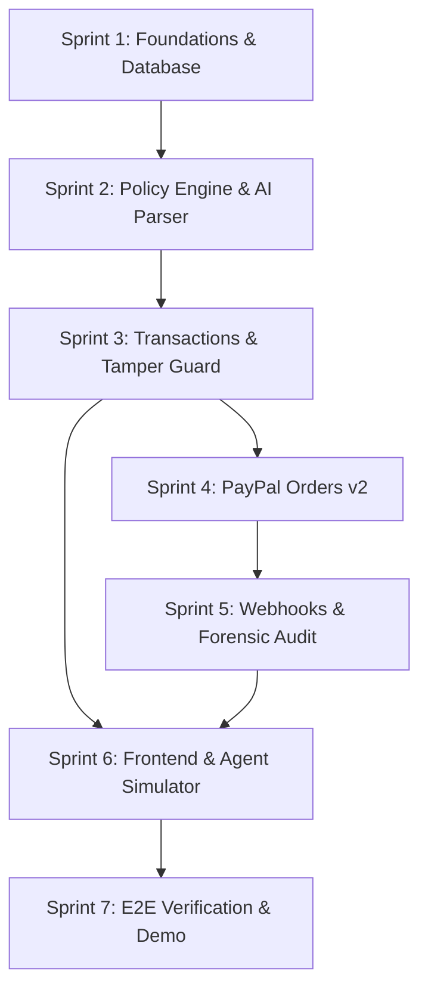

# PayPal Guardian — Sprint Tracking Dashboard

> **Project:** PayPal Guardian — The firewall between AI and your money  
> **Status:** Active Implementation  
> **Target:** AI/PayPal Hackathon MVP & Production Prototype  

---

## 1. Sprint Execution & Tracking Matrix

| Sprint | Name | Status | Tasks Complete | Deliverables | Link |
| :--- | :--- | :---: | :---: | :--- | :--- |
| **Sprint 1** | **Foundations & Database** | 🟢 Completed | 6 / 6 | Monorepo scaffolding, Fastify server, Prisma ORM, PostgreSQL schema, Seeds | [SPRINT_01](./SPRINT_01_FOUNDATIONS_AND_DATABASE.md) |
| **Sprint 2** | **Policy Engine & AI Parser** | ⚪ Pending | 0 / 6 | Deterministic Policy Engine, Canonical Snapshot Hasher, Gemini/OpenAI Parser | [SPRINT_02](./SPRINT_02_POLICY_ENGINE_AND_AI.md) |
| **Sprint 3** | **Transaction Lifecycle & Tamper Guard** | ⚪ Pending | 0 / 5 | Proposal ingestion, ALLOW/ASK/BLOCK flow, User approval, Tamper detection | [SPRINT_03](./SPRINT_03_TRANSACTIONS_AND_TAMPER.md) |
| **Sprint 4** | **PayPal Orders v2 Integration** | ⚪ Pending | 0 / 5 | OAuth2 token cache, Sandbox Orders v2 Create & Capture, Idempotency keys | [SPRINT_04](./SPRINT_04_PAYPAL_ORDERS_INTEGRATION.md) |
| **Sprint 5** | **Webhooks, Audit & Security** | ⚪ Pending | 0 / 5 | Webhook signature verification, Append-only audit events, Prompt injection filter | [SPRINT_05](./SPRINT_05_WEBHOOKS_AUDIT_SECURITY.md) |
| **Sprint 6** | **Frontend & Agent Simulator** | ⚪ Pending | 0 / 6 | Next.js 14 App Router, Conversational Policy UI, Approval Drawer, Agent Simulator | [SPRINT_06](./SPRINT_06_FRONTEND_AND_SIMULATOR.md) |
| **Sprint 7** | **E2E Verification & Demo Rehearsal** | ⚪ Pending | 0 / 5 | Test suites, Tamper demo verification, 7-scene hackathon recording, Deployment | [SPRINT_07](./SPRINT_07_E2E_VERIFICATION_DEMO.md) |

---

## 2. Sprint Dependency Graph

---

## 3. How to Track Progress

- Every sprint document in this folder contains granular tasks with checkboxes (`- [ ]`).
- When a task is started, it can be marked as `🟡 In Progress`.
- When a task is completed and verified with tests or builds, mark it as `- [x]`.
- Update the **Tasks Complete** counter and status column in this table accordingly.
